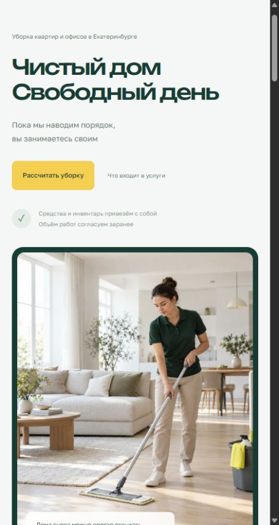

# ТИХО — клининговая компания

Лендинг вымышленной клининговой компании для портфолио. Дизайн и разработка: [Максим Дегтярёв](https://t.me/maxblads).



## Возможности

- Четыре услуги с раскрываемым составом работ
- Интерактивное сравнение кухни до и после уборки
- Калькулятор по площади с минимальной стоимостью и дополнительными услугами
- Перенос расчёта в форму и проверка контактных данных
- Адаптивная верстка, управление с клавиатуры и поддержка reduced motion
- Шесть сгенерированных фотографий в формате WebP

Компания и тарифы вымышлены. Форма демонстрационная: данные никуда не отправляются и не сохраняются. Telegram автора предназначен для обсуждения разработки сайта.

## Локальный запуск

Сайт написан на HTML, CSS и JavaScript, сборка не требуется. Из корня репозитория:

```sh
python -m http.server 5194 --directory dist
```

Откройте `http://localhost:5194`. Для статического хостинга используйте содержимое `dist`.

## Файлы

- `dist/index.html` — разметка и контент
- `dist/style.css`, `dist/details.css` — стили
- `dist/app.js` — калькулятор, сравнение и демо-форма
- `dist/assets` — изображения
- `design.md` — визуальное направление

Шрифты Unbounded и Golos Text подключены через Google Fonts; предусмотрены системные запасные шрифты.
